<p align="center">
  
</p>
<p align="center">
  <a href="https://discord.gg/vksT5csPbd"></a>
  <a href="https://discord.gg/mNeQZzBHuW"></a>
  <a href="https://ko-fi.com/theborch"></a>
</p>

# 👽🧙 OARC 🤬🤖

A Python package for OARC functionality.

## Installation

```bash
# Clone the repository
git clone https://github.com/Leoleojames1/OARC.git
cd OARC

# Create & activate virtual environment
python -m venv .venv
.venv\Scripts\activate

# Install the package with pip (editable mode)
pip install -e .

# Install additional dependencies
oarc setup
```

## Development

```bash
# Install development dependencies
oarc develop
```

## Building from source

```bash
# Build the oarc as a wheel from source
oarc build
```

## Running OARC

```bash
# Activate environment where OARC is installed
oarc
```

## Commands

- `oarc` - Run the main CLI tool
- `oarc setup` - Install all dependencies
- `oarc develop` - Setup developer mode
- `oarc build` = Build from source code

## Architecture

```mermaid
classDiagram
    %% Core System Components
    class API {
        +initialize_apis()
        +setup_routes()
    }
    
    class BaseToolAPI {
        +setup_routes()
        +router: APIRouter
    }
    
    class Server {
        +initialize()
        +start()
        +stop()
        +status()
    }
    
    class PandasDB {
        +setup_query_engine()
        +query_data()
        +storeAgent()
        +setAgent()
        +coreAgent()
        +initializeConversation()
    }
    
    %% Agent Components
    class AgentStorage {
        +initialize_agent_storage()
        +setup_default_agents()
        +initializeAgentFlags()
        +load_agent()
        +list_available_agents()
    }
    
    class MultiModalPrompting {
        +llava_prompt()
        +embedding_ollama_prompt()
        +shot_prompt()
        +design_prompt()
        +chainOfThought()
        +deepResearch()
        +swarmPrompt()
    }
    
    %% Speech Components
    class TextToSpeech {
        +process_tts_responses()
        +generate_audio()
        +initialize_tts_model()
    }
    
    class SpeechToText {
        +listen()
        +recognizer()
        +whisperSTT()
        +googleSTT()
    }
    
    class SpeechManager {
        +initialize_tts_model()
        +generate_speech()
    }
    
    %% Vision Components
    class YoloProcessor {
        +process_frame()
        +load_model()
        +capture_screen()
    }
    
    %% Command & Control
    class FlagManager {
        +speech()
        +llava_flow()
        +yolo_state()
        +get_agent_state()
    }
    
    class commandLibrary {
        +updateCommandLibrary()
    }
    
    %% Search & Dataset Components
    class DuckDuckGoSearch {
        +text_search()
        +image_search()
        +news_search()
        +store_results()
    }
    
    class GitHubRepoCloner {
        +clone_and_store_repo()
    }
    
    class Crawl4AISearchAPI {
        +scrape_url()
        +format_result()
        +store_result()
    }
    
    %% Dataset Agents (Your Focus Area)
    class DatasetAgents {
        +collect_dataset()
        +generate_dataset()
        +augment_dataset()
        +clean_dataset()
    }
    
    class DatasetCollector {
        +search_sources()
        +process_results()
        +store_dataset()
    }
    
    class DatasetGenerator {
        +ollama_generate()
        +process_generation()
        +save_generated_data()
    }
    
    class DatasetAugmenter {
        +augment_with_feedback()
        +deep_search_augmentation()
        +multimodal_augmentation()
    }
    
    class DatasetCleaner {
        +detect_errors()
        +regenerate_garbage_data()
        +validate_dataset()
    }
    
    %% HuggingFace Integration
    class HuggingFaceHub {
        +download_model()
        +upload_model()
        +upload_dataset()
    }
    
    %% Utilities
    class Paths {
        +get_model_dir()
        +ensure_paths()
    }
    
    %% Relationships
    API --|> BaseToolAPI
    TextToSpeech o-- SpeechManager
    SpeechToText o-- SpeechManager
    AgentStorage o-- PandasDB
    AgentStorage -- MultiModalPrompting
    
    FlagManager -- commandLibrary
    FlagManager -- YoloProcessor
    FlagManager -- TextToSpeech
    FlagManager -- SpeechToText
    
    DatasetAgents *-- DatasetCollector
    DatasetAgents *-- DatasetGenerator
    DatasetAgents *-- DatasetAugmenter
    DatasetAgents *-- DatasetCleaner
    
    DatasetCollector -- DuckDuckGoSearch
    DatasetCollector -- GitHubRepoCloner
    DatasetCollector -- Crawl4AISearchAPI
    
    DatasetGenerator -- MultiModalPrompting
    DatasetAugmenter -- MultiModalPrompting
    
    DatasetAgents -- HuggingFaceHub
    
    MultiModalPrompting -- PandasDB
```

