# 👂OARC STS Architecture👄

OARC utilizes a gambit of speech to speech algorthms to wrap our stt and tts models around our llms. The core features include:
- Silence removal preprocess for stt
- smart user interrupt features
- wake words
- debate moderator mode, faq checking, smart listening
- llm sentence chunking preprocess for tts
- generates each sentence chunk in succession, and generates each sentence chunk while the tts is playing,
allowing for the STS to keep up with the most recent sentence chunk.

# High Level

The following is a high level breakdown of how oarc creates seemless speech to speech algorithms with out speech to text --> LLM/LLAVA/LCM/SUB-AGENT --> text to speech architecture:

```mermaid
%%{init: {'theme': 'dark', 'themeVariables': { 'primaryColor': '#242438', 'primaryTextColor': '#f0f0f0', 'primaryBorderColor': '#555', 'lineColor': '#555', 'secondaryColor': '#323248', 'tertiaryColor': '#242438'}}}%%

flowchart LR
    User((User)) --> |"Speech Input"| STT
    
    subgraph SpeechToSpeech["OARC STS System"]
        direction LR
        style SpeechToSpeech fill:#1e1e2e,stroke:#555,stroke-width:1px
        
        STT["Speech Recognition\n(Wake Words & Silence Removal)"]
        style STT fill:#a2c5ff,stroke:#555,stroke-width:1px,color:#222
        
        LLM["Large Language Model\n(Text Processing)"]
        style LLM fill:#c5a2ff,stroke:#555,stroke-width:1px,color:#222
        
        TTS["Text-to-Speech\n(Sentence Chunking)"]
        style TTS fill:#ffa2c5,stroke:#555,stroke-width:1px,color:#222
        
        InterruptSystem["Interrupt System"]
        style InterruptSystem fill:#ffa2c5,stroke:#555,stroke-width:1px,color:#222,stroke-dasharray: 5 5
        
        STT --> LLM
        LLM --> TTS
        InterruptSystem -.-> TTS
        User -.-> |"Interrupt Controls"| InterruptSystem
    end
    
    TTS --> |"Concurrent Generation\n& Streaming"| User
    
    %% Core Models
    GoogleSTT[/"Google Speech API"/]
    style GoogleSTT fill:#ffb3b3,stroke:#555,stroke-width:1px,rx:25,ry:25,color:#222
    GoogleSTT -.-> STT
    
    WhisperModel[/"Whisper"/]
    style WhisperModel fill:#ffb3b3,stroke:#555,stroke-width:1px,rx:25,ry:25,color:#222
    WhisperModel -.-> STT
    
    CoquiXTTS[/"Coqui XTTS v2"/]
    style CoquiXTTS fill:#ffb3b3,stroke:#555,stroke-width:1px,rx:25,ry:25,color:#222
    CoquiXTTS -.-> TTS
    
    %% Features
    DebateMode["Debate Moderator Mode\nFAQ Checking\nSmart Listening"]
    style DebateMode fill:#a2ffc5,stroke:#555,stroke-width:1px,color:#222,stroke-dasharray: 5 5
    DebateMode -.-> LLM
```

# Main Architechture

The following is a more in depth architechural flow for the speech_to_text.py and text_to_speech.py modules involvement with oarc agents:

```mermaid
%%{init: {'theme': 'dark', 'themeVariables': { 'primaryColor': '#242438', 'primaryTextColor': '#f0f0f0', 'primaryBorderColor': '#555', 'lineColor': '#555', 'secondaryColor': '#323248', 'tertiaryColor': '#242438'}}}%%

flowchart LR
    %% Title
    Title["Speech-to-Speech System Architecture"]
    style Title fill:none,stroke:none,color:#f0f0f0,font-size:18px,font-weight:bold
    
    %% User Input/Output nodes
    UserInput((User<br>Input)) --> SimpleSTT
    SimpleTTS --> UserOutput((User<br>Output))
    style UserInput fill:#2b2b42,stroke:#6a6a8e,color:#f0f0f0
    style UserOutput fill:#2b2b42,stroke:#6a6a8e,color:#f0f0f0
    
    %% Simple View
    subgraph SimpleView["Simple View"]
        direction LR
        style SimpleView fill:#1e1e2e,stroke:#555,stroke-width:1px
        
        SimpleSTT["Speech Recognition"]
        style SimpleSTT fill:#a2c5ff,stroke:#555,stroke-width:1px,color:#222
        
        SimpleProcessing["Text Processing"]
        style SimpleProcessing fill:#c5a2ff,stroke:#555,stroke-width:1px,color:#222
        
        SimpleTTS["Text-to-Speech"]
        style SimpleTTS fill:#ffa2c5,stroke:#555,stroke-width:1px,color:#222
        
        SimpleSTT --> SimpleProcessing --> SimpleTTS
    end
    
    %% Complex View
    subgraph ComplexView["Detailed Implementation"]
        direction LR
        style ComplexView fill:#28283e,stroke:#555,stroke-width:1px
        
        %% Speech-to-Text Pipeline
        subgraph STTPipeline["STT Pipeline"]
            direction TB
            style STTPipeline fill:#2d2d45,stroke:#555,stroke-width:1px
            
            AudioCapture["Audio Capture"] --> SilenceDetection["Silence Detection"]
            SilenceDetection --> WakeWordDetection["Wake Word Detection"]
            WakeWordDetection --> AudioBuffering["Audio Buffering"]
            AudioBuffering --> ModelSelection["Model Selection"]
            
            style AudioCapture fill:#a2c5ff,stroke:#555,stroke-width:1px,color:#222
            style SilenceDetection fill:#a2c5ff,stroke:#555,stroke-width:1px,color:#222
            style WakeWordDetection fill:#a2c5ff,stroke:#555,stroke-width:1px,color:#222
            style AudioBuffering fill:#a2c5ff,stroke:#555,stroke-width:1px,color:#222
            style ModelSelection fill:#a2c5ff,stroke:#555,stroke-width:1px,color:#222
        end
        
        %% STT Models
        subgraph STTModels["STT Models"]
            direction LR
            style STTModels fill:#3d3d5c,stroke:#555,stroke-width:1px
            
            GoogleSTT[/"Google Speech API"/]
            style GoogleSTT fill:#ffb3b3,stroke:#555,stroke-width:1px,rx:25,ry:25,color:#222
            
            WhisperModel[/"Whisper Model"/]
            style WhisperModel fill:#ffb3b3,stroke:#555,stroke-width:1px,rx:25,ry:25,color:#222
        end
        
        %% Text Processing
        subgraph TextProcessing["Text Processing"]
            direction LR
            style TextProcessing fill:#2d2d45,stroke:#555,stroke-width:1px
            
            ArgFilter["Voice Arg Filter"] --> CommandDetection["Command Detection"] --> TextQueue["Text Queue"]
            
            style ArgFilter fill:#c5a2ff,stroke:#555,stroke-width:1px,color:#222
            style CommandDetection fill:#c5a2ff,stroke:#555,stroke-width:1px,color:#222
            style TextQueue fill:#c5a2ff,stroke:#555,stroke-width:1px,color:#222
        end
        
        %% TTS Pipeline
        subgraph TTSPipeline["TTS Pipeline"]
            direction TB
            style TTSPipeline fill:#2d2d45,stroke:#555,stroke-width:1px
            
            SentenceSplitter["Sentence Splitter"] --> AudioGeneration["Audio Generation"]
            VoiceSelection["Voice Selection"] --> AudioGeneration
            ModelInitialization["Model Init"] --> AudioGeneration
            InterruptHandler["Interrupt Handler"] --> AudioGeneration
            
            style SentenceSplitter fill:#ffa2c5,stroke:#555,stroke-width:1px,color:#222
            style AudioGeneration fill:#ffa2c5,stroke:#555,stroke-width:1px,color:#222
            style VoiceSelection fill:#ffa2c5,stroke:#555,stroke-width:1px,color:#222
            style ModelInitialization fill:#ffa2c5,stroke:#555,stroke-width:1px,color:#222
            style InterruptHandler fill:#ffa2c5,stroke:#555,stroke-width:1px,color:#222
        end
        
        %% TTS Model
        subgraph TTSModel["TTS Model"]
            direction LR
            style TTSModel fill:#3d3d5c,stroke:#555,stroke-width:1px
            
            CoquiXTTS[/"Coqui XTTS v2"/]
            style CoquiXTTS fill:#ffb3b3,stroke:#555,stroke-width:1px,rx:25,ry:25,color:#222
        end
        
        %% Output Processing
        subgraph OutputPipeline["Output Processing"]
            direction LR
            style OutputPipeline fill:#2d2d45,stroke:#555,stroke-width:1px
            
            AudioNormalization["Normalization"] --> WebsocketStreaming["Websocket"] --> AudioPlayback["Playback"]
            
            style AudioNormalization fill:#a2ffc5,stroke:#555,stroke-width:1px,color:#222
            style WebsocketStreaming fill:#a2ffc5,stroke:#555,stroke-width:1px,color:#222
            style AudioPlayback fill:#a2ffc5,stroke:#555,stroke-width:1px,color:#222
        end
        
        %% Layout and connections
        STTPipeline --> STTModels
        STTModels --> TextProcessing
        TextProcessing --> TTSPipeline
        TTSPipeline --> TTSModel
        TTSModel --> OutputPipeline
    end
    
    %% Connections between views
    SimpleSTT -.-> STTPipeline
    STTModels -.-> SimpleSTT
    
    SimpleProcessing -.-> TextProcessing
    
    SimpleTTS -.-> TTSPipeline
    TTSModel -.-> SimpleTTS
    OutputPipeline -.-> SimpleTTS
```

# Implementation Examples and Alternative Approaches

## Low-Latency Local Speech-to-Speech
Based on the implementation demonstrated by All About AI, a local low-latency approach can be achieved using:
- **Speech Recognition**: Whisper for local STT processing
- **Language Model**: Mistral 7B for text processing
- **Voice Generation**: OpenVoice for TTS synthesis
- **Key Benefits**: 
  - Reduced latency through local processing
  - No data sent to external services
  - Full control over model parameters

## Bidirectional Streaming Architecture
As demonstrated in Chris Cappetta's implementation:
- **Streaming STT**: Real-time speech transcription
- **Incremental Processing**: Process text as it arrives
- **Concurrent TTS**: Generate speech while processing continues
- **Benefits**:
  - Reduced perceived latency
  - More natural conversation flow
  - Better interrupt handling

## Integration with OARC's Architecture
These approaches complement OARC's existing architecture:
- Can be integrated into the STTModels component alongside existing models
- Supports OARC's sentence chunking and interrupt system
- Enhances the existing pipeline with local processing options

## Performance Considerations
When implementing these approaches:
- Balance between model size and latency
- Consider hardware requirements for local models
- Optimize chunking for real-time performance
- Monitor memory usage with local models

## Future Directions
Potential enhancements based on these implementations:
- Hybrid cloud/local processing options
- Dynamic model selection based on requirements
- Enhanced interrupt handling from bidirectional streaming
- Integration with OARC's debate moderator mode

# Video Resources and Implementation Examples

### 1. Local Low Latency Speech to Speech Implementation
- **Source**: All About AI
- **URL**: [Watch Video](https://www.youtube.com/watch?v=0k8wUfU7n4Q)
- **Key Points**:
  - Integration of Mistral 7B with OpenVoice/Whisper
  - Practical example of multi-modal agent architecture
  - Open-source implementation demonstration

### 2. Exploring Morality Through Agent Architecture
- **Source**: Chris Cappetta
- **URL**: [Watch Video](https://www.youtube.com/watch?v=affArIZNPC8)
- **Code Repository**: [GitHub](https://github.com/ccappetta/bidirectional_streaming_ai_voice)
- **Key Points**:
  - Implementation of tuned instructions for moral reasoning
  - Bidirectional streaming voice interaction architecture
  - Open-source code for voice-enabled agent systems