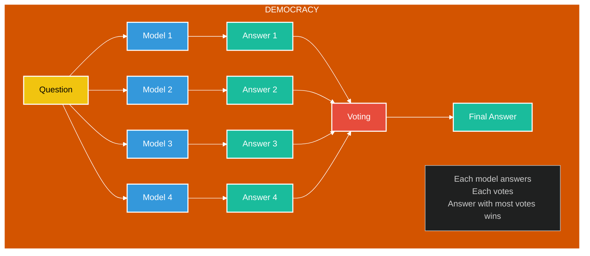
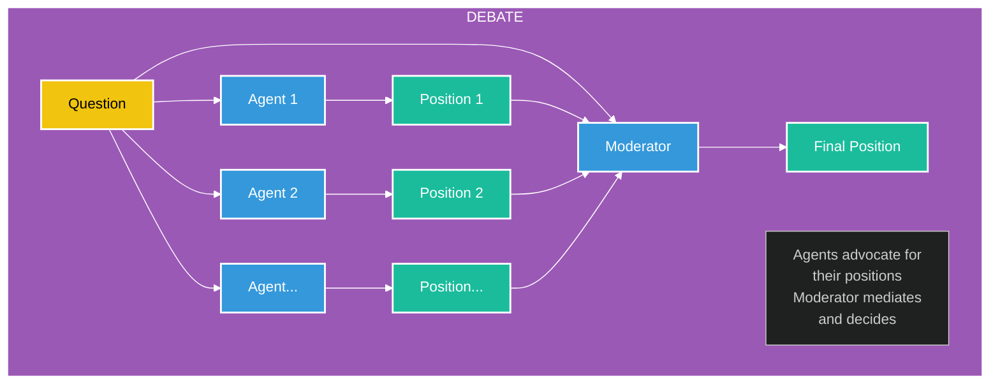
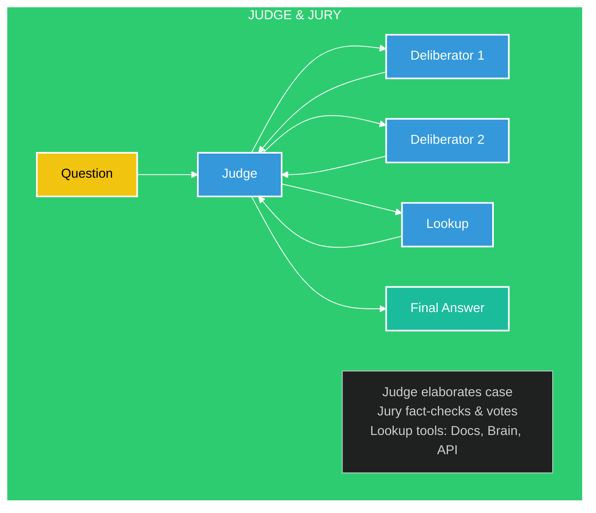
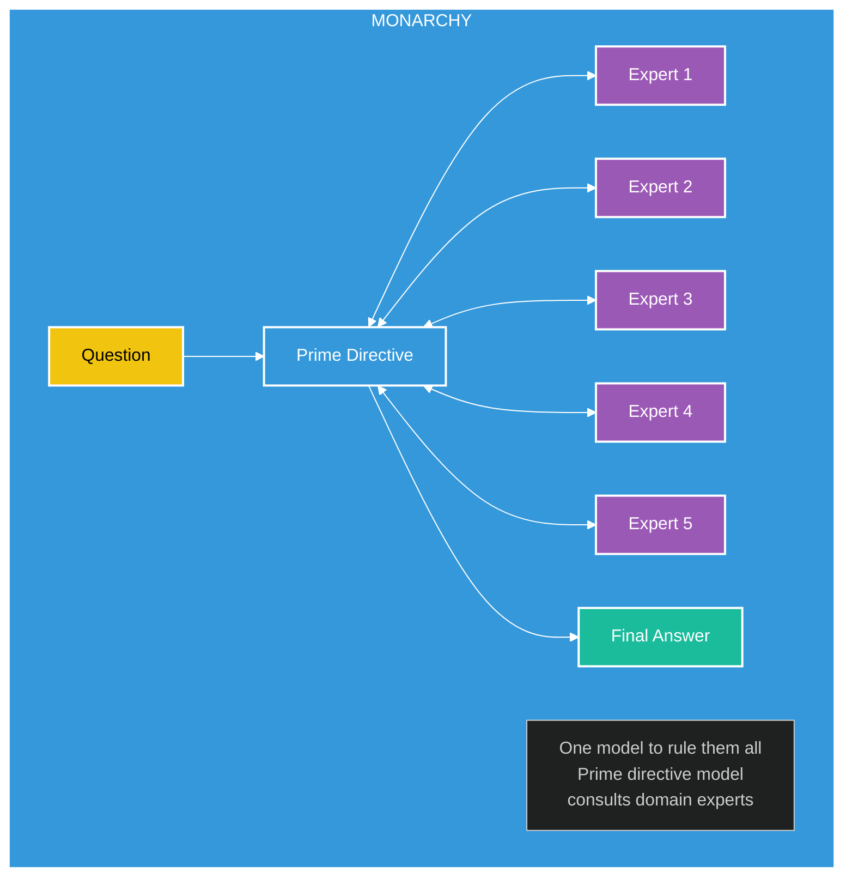

# Mixture of Models (MoM) Architectures

This document explores different architectural patterns for composing multiple AI models to work together in a synergistic manner. These patterns represent different governance models for how multiple models can collaborate, vote, debate, or support each other to produce better results than any single model could achieve alone.

## 1. Democracy Architecture

In the Democracy architecture, multiple models independently answer the same question, and the final answer is determined by a voting process.

### Key Characteristics

- **Equal Participation**: Each model receives the same question and generates its own answer.
- **Majority Rule**: The final answer is determined by which option receives the most votes.
- **No Hierarchy**: No model has more authority than others.
- **Simple Aggregation**: Works best when answers can be clearly categorized or binned.

### Use Cases

- Classification problems where models might have different specializations
- Factual questions with discrete possible answers
- Problems where model diversity helps avoid individual biases

### Implementation Considerations

- Requires a voting mechanism to count and determine the winning answer
- May need tie-breaking procedures for evenly split votes
- Can be extended with weighted voting based on model confidence or past performance

## 2. Debate Architecture

The Debate architecture facilitates structured discussion between multiple agent models, with a moderator model guiding the process and making the final determination.

### Key Characteristics

- **Adversarial Process**: Models openly debate and challenge each other's reasoning.
- **Structured Dialogue**: The moderator guides discussion and ensures productive exchange.
- **Reasoning Transparency**: Requires models to explain their positions and counter others.
- **Mediated Decision**: The moderator evaluates arguments and determines the strongest position.

### Use Cases

- Complex reasoning tasks with multiple valid approaches
- Ethical or subjective questions where reasoning quality matters
- Scenarios requiring thorough exploration of multiple perspectives

### Implementation Considerations

- Requires defining debate protocols and structure
- May involve multiple rounds of exchange between agents
- Moderator model needs special capabilities to evaluate arguments

## 3. Judge & Jury Architecture

The Judge & Jury architecture separates the presentation of the case from its evaluation, with additional lookup tools to verify facts.

### Key Characteristics

- **Separation of Duties**: Judge presents the case, jury deliberates and evaluates.
- **External Verification**: Incorporates lookup tools to verify facts and claims.
- **Structured Deliberation**: Jury models discuss and fact-check specific aspects.
- **Evidence-Based**: Emphasizes factual accuracy and verifiable information.

### Use Cases

- Fact-intensive questions requiring verification
- Legal or rule-based reasoning where evidence matters
- Tasks requiring both reasoning and factual accuracy

### Implementation Considerations

- Requires integration with external knowledge sources
- Needs clear protocols for deliberation and evaluation
- Judge must be capable of synthesizing jury feedback

## 4. Monarchy Architecture

The Monarchy architecture features a central "Prime Directive" model that consults with domain expert models before making decisions.

### Key Characteristics

- **Centralized Authority**: One primary model directs the process and makes decisions.
- **Specialized Consultation**: Domain expert models provide specialized knowledge.
- **Bidirectional Communication**: Prime model queries experts and receives input.
- **Integrated Decision**: Prime model synthesizes expert input into final answer.

### Use Cases

- Tasks requiring broad knowledge integration
- Questions spanning multiple domains
- Scenarios needing a consistent voice or approach

### Implementation Considerations

- Prime model must be capable of knowing when to consult experts
- Requires defining expert domains and consultation protocols
- Balance between expert input and prime model authority

## Comparison and Selection Guide

| Architecture | Strengths | Weaknesses | Best For |
|--------------|-----------|------------|----------|
| Democracy | Simple, fair, reduces individual biases | May select mediocre consensus answers | Classification, factual questions |
| Debate | Thorough exploration of alternatives, transparent reasoning | Complex to implement, computationally intensive | Reasoning tasks, ethical questions |
| Judge & Jury | Fact verification, structured evaluation | Requires external tools integration | Fact-intensive queries, legal reasoning |
| Monarchy | Consistent voice, efficient knowledge integration | Depends heavily on prime model quality | Cross-domain questions, consistent outputs |

## Implementation and Extensions

These architectures can be extended and combined in various ways:

- **Weighted Democracy**: Models with better historical performance get more voting power
- **Multi-stage Processing**: Use different architectures for different phases of problem-solving
- **Hybrid Approaches**: Combine elements of multiple architectures (e.g., Debate with Lookup)
- **Dynamic Selection**: Choose architecture based on question type or complexity

## Conclusion

The choice of MoM architecture should be guided by the specific requirements of your application, the nature of the problems being solved, and the characteristics of the available models. Each architecture offers unique advantages and challenges, making them suitable for different use cases.

By thoughtfully designing how multiple models interact, we can create AI systems that leverage the strengths of different models while mitigating their individual weaknesses, resulting in more robust, accurate, and trustworthy outputs.
