# What is an Agent? 🤖🧠

Agentic Multi-modal Superalignment (AMS): OARC aims to achieve multi-modal super alignment within Agentic action spaces and inter-communication protocols. This foundation drives our approach to building powerful, coherent AI systems that can reason across different modalities.

# Agent Definition 💭
"An agent refers to the algorithmic logic that wraps a model and via iteration, generates the chain of thought output for the model" — Borch, because I think this definition is important.

This definition captures the essence of what makes OARC agents powerful: they're not just models but systems with algorithmic reasoning capabilities that evolve through iterative processes, maintaining consistent behavior across different inputs and contexts.

# The Agentic Action Space 🚀
The agentic action space is the realm where LLM-generated text prompts transcend mere words and become actionable through programming logic. This intersection is where OARC agents live - transforming language understanding into concrete actions in the digital and physical world.

# Core Components of OARC Agents
# OARC agents are comprised of several key components that work together:

1. Modal Flags 🏁 - Configure agent capabilities (TTS_FLAG, STT_FLAG, LLAVA_FLAG, etc.)
2. Models Configuration 📊 - Define which language, vision, and speech models the agent uses
3. Prompt Templates 📝 - System and booster prompts that guide agent behavior
4. Database Connections 💾 - Knowledge bases and conversation history
5. Tool Calling APIs 🔧 - External services and functions the agent can access

```mermaid
graph TB
    subgraph "Reality Input Space 🌍"
        A[Vision 👁️] 
        B[Text 📝]
        C[Audio 🔊]
    end
    
    subgraph "Processing Layer 🧪"
        D[Agent Library 📚]
        E[Model Selection 🔍]
        F[LLMs 🧠]
        G[Vision Models 👁️‍🗨️]
        H[Embedding Models 🔗]
        I[Knowledge Base 💾]
        J[RAG System 📊]
        K[Speech Pipeline 🗣️]
        L[Tool Calling API 🔧]
        M[Search APIs 🔎]
    end
    
    subgraph "Output Space 💫"
        N[Text Generation 📃]
        O[Speech Generation 🎙️]
        P[Image Generation 🖼️]
        Q[Action Execution ⚡]
    end
    
    A --> D
    B --> D
    C --> D
    
    D --> E
    E --> F & G & H
    
    F --> I
    F --> J
    F --> L
    
    G --> J
    H --> J
    
    I --> J
    
    J --> N
    K --> O
    L --> M
    L --> Q
    
    F --> N
    G --> P
    M --> N
    
    style D fill:#f9d77e,stroke:#333,stroke-width:2px
    style E fill:#f9d77e,stroke:#333,stroke-width:2px
    style F fill:#a3c9ff,stroke:#333,stroke-width:2px
    style J fill:#a3c9ff,stroke:#333,stroke-width:2px
    style Q fill:#ff9d9d,stroke:#333,stroke-width:2px
```



# OARC Agent Implementation 🛠️

OARC's implementation of agents goes beyond theoretical concepts. Each agent in the system is defined by:

## Identity and Core Attributes

```python
agent_core = {
    "identifiers": {
        "agent_id": "unique_agent_id",
        "uid": None,
        "template_version_info": {"version": "1.0.0"}
    }
}
```

## Modality Flags

OARC agents use a sophisticated flag system to enable specific capabilities:

```python
modality_flags = {
    "TTS_FLAG": True,           # Text-to-Speech enabled
    "STT_FLAG": True,           # Speech-to-Text enabled
    "LLAVA_FLAG": True,         # Vision capabilities
    "EMBEDDING_FLAG": True,     # Vector embeddings for RAG
    "AUTO_SPEECH_FLAG": False,  # Automatic speech response
    "SCREEN_SHOT_FLAG": False   # Screen capture abilities
}
```

## Multi-Modal Integration
OARC agents uniquely bridge different modalities through specialized methods:

- llava_prompt() - Processes vision inputs with language
- embedding_ollama_prompt() - Leverages vector databases for knowledge retrieval
- shot_prompt() - Creates one-off prompts without affecting agent state

# Default Agents in OARC
The system comes with several pre-configured agents:

1. promptBase - General-purpose conversational agent
2. minecraft_agent - Specialized for Minecraft visual analysis and guidance
3. navigator_agent - Visual exploration assistant with real-time description
4. speedChatAgent - Optimized for quick, conversational interactions

# The Science Behind Agents 🔬🧬
Agents represent a convergence of several disciplines:

1. Machine Learning - Foundation models provide base capabilities
2. Cognitive Science - Reasoning frameworks and planning models
3. Systems Theory - Component integration and feedback loops
4. Decision Theory - Choice-making under uncertainty

# Speech-to-Speech Architecture
OARC implements a sophisticated speech-to-speech pipeline that enables fluid voice interaction with agents:


# Why OARC Agents Matter 🌟
In the OARC ecosystem, agents provide critical capabilities:

- Context Persistence - Maintain coherent conversations across interactions
- Multi-step Reasoning - Break complex tasks into manageable steps
- Tool Integration - Seamlessly connect to external systems and data sources
- Multi-modal Understanding - Process and generate text, images, and speech
- Personalized Interaction - Adapt to user preferences and needs

# The Future of OARC Agents 🔮
As we continue to refine our agents, we're working toward:

- Recursive Self-Improvement - Agents that can enhance their own capabilities
- Collaborative Teams - Groups of specialized agents working together
- Enhanced Reasoning - More sophisticated planning and problem-solving
- Value Alignment - Agents that understand and respect human values

OARC's agent architecture provides a foundation for these advances, enabling AI assistants that are more capable, more aligned, and more helpful than ever before.