# What is an Agent? 🤖🧠

Agentic Multi-modal Superalignment (AMS): Building on established principles of agent-based modeling (ABM)[1] and agentic AI[2], OARC aims to achieve multi-modal super alignment within Agentic action spaces and inter-communication protocols. This foundation drives our approach to building powerful, coherent AI systems that can reason across different modalities, integrating concepts from both microscale and macroscale models[3] to create more sophisticated autonomous systems.

# Agent Definition 💭
"An agent refers to the algorithmic logic that wraps a model and via iteration, generates the chain of thought output for the model" — Borch, because I think this definition is important.

This definition aligns with the core principles of agentic AI, where autonomous systems make decisions and perform tasks without human intervention through continuous learning and analysis[2]. As noted in recent research, agents are characterized as boundedly rational entities acting in their perceived interests using heuristics and adaptive decision-making rules[1]. They combine elements of game theory, complex systems, emergence, and evolutionary programming to maintain consistent behavior across different inputs and contexts.

# The Agentic Action Space 🚀
The agentic action space represents the convergence of autonomous decision-making and concrete action execution. Drawing from reinforcement learning principles, it's where LLM-generated text prompts transcend mere words and become actionable through programming logic. This intersection is where OARC agents live - transforming language understanding into concrete actions in the digital and physical world while continuously learning from feedback through exploration and reward mechanisms.

# Core Components of OARC Agents
# OARC agents are comprised of several key components that work together:

1. Modal Flags 🏁 - Configure agent capabilities through microscale behavioral controls (TTS_FLAG, STT_FLAG, LLAVA_FLAG, etc.)
2. Models Configuration 📊 - Define which language, vision, and speech models the agent uses, integrating both microscale (individual model) and macroscale (model ensemble) behaviors
3. Prompt Templates 📝 - System and booster prompts that guide agent behavior through emergence-driven interaction patterns
4. Database Connections 💾 - Knowledge bases and conversation history supporting both individual agent memory and collective knowledge sharing
5. Tool Calling APIs 🔧 - External services and functions enabling agent-environment interaction and adaptation

Drawing from agent-based modeling principles, these components work together to create emergent system-level behaviors that are greater than the sum of their parts. The interaction topology between components is carefully designed to support both individual agent autonomy and collective intelligence.



```mermaid
graph TB
    subgraph "Reality Input Space 🌍"
        A[Vision 👁️] 
        B[Text 📝]
        C[Audio 🔊]
    end
    
    subgraph "Processing Layer 🧪"
        D[Agent Library 📚]
        E[Model Selection 🔍]
        F[LLMs 🧠]
        G[Vision Models 👁️‍🗨️]
        H[Embedding Models 🔗]
        I[Knowledge Base 💾]
        J[RAG System 📊]
        K[Speech Pipeline 🗣️]
        L[Tool Calling API 🔧]
        M[Search APIs 🔎]
    end
    
    subgraph "Output Space 💫"
        N[Text Generation 📃]
        O[Speech Generation 🎙️]
        P[Image Generation 🖼️]
        Q[Action Execution ⚡]
    end
    
    A --> D
    B --> D
    C --> D
    
    D --> E
    E --> F & G & H
    
    F --> I
    F --> J
    F --> L
    
    G --> J
    H --> J
    
    I --> J
    
    J --> N
    K --> O
    L --> M
    L --> Q
    
    F --> N
    G --> P
    M --> N
    
    style D fill:#f9d77e,stroke:#333,stroke-width:2px
    style E fill:#f9d77e,stroke:#333,stroke-width:2px
    style F fill:#a3c9ff,stroke:#333,stroke-width:2px
    style J fill:#a3c9ff,stroke:#333,stroke-width:2px
    style Q fill:#ff9d9d,stroke:#333,stroke-width:2px
```

# OARC Agent Implementation 🛠️

OARC's implementation of agents goes beyond theoretical concepts. Each agent in the system is defined by:

## Identity and Core Attributes

```python
agent_core = {
    "identifiers": {
        "agent_id": "unique_agent_id",
        "uid": None,
        "template_version_info": {"version": "1.0.0"}
    }
}
```

## Modality Flags

OARC agents use a sophisticated flag system to enable specific capabilities:

```python
modality_flags = {
    "TTS_FLAG": True,           # Text-to-Speech enabled
    "STT_FLAG": True,           # Speech-to-Text enabled
    "LLAVA_FLAG": True,         # Vision capabilities
    "EMBEDDING_FLAG": True,     # Vector embeddings for RAG
    "AUTO_SPEECH_FLAG": False,  # Automatic speech response
    "SCREEN_SHOT_FLAG": False   # Screen capture abilities
}
```

## Multi-Modal Integration
OARC agents uniquely bridge different modalities through specialized methods:

- llava_prompt() - Processes vision inputs with language
- embedding_ollama_prompt() - Leverages vector databases for knowledge retrieval
- shot_prompt() - Creates one-off prompts without affecting agent state

# Default Agents in OARC
The system comes with several pre-configured agents:

1. promptBase - General-purpose conversational agent
2. minecraft_agent - Specialized for Minecraft visual analysis and guidance
3. navigator_agent - Visual exploration assistant with real-time description
4. speedChatAgent - Optimized for quick, conversational interactions

# The Science Behind Agents 🔬🧬
Agents represent a convergence of several disciplines:

1. Machine Learning - Foundation models provide base capabilities, leveraging both deep learning and reinforcement learning for autonomous decision-making
2. Cognitive Science - Reasoning frameworks and planning models based on bounded rationality and heuristic decision-making
3. Systems Theory - Component integration and feedback loops enabling emergence from microscale to macroscale behaviors
4. Decision Theory - Choice-making under uncertainty through continuous learning and environmental adaptation
5. Complex Systems - Study of emergent behaviors and self-organization principles in multi-agent systems

Recent advances in Retrieval Augmented Generation (RAG)[4] and knowledge graph integration have further enhanced agents' ability to reason over structured and unstructured information, enabling more sophisticated question-answering and decision-making capabilities.

# Speech-to-Speech Architecture
OARC implements a sophisticated speech-to-speech pipeline that enables fluid voice interaction with agents:


# Why OARC Agents Matter 🌟
In the OARC ecosystem, agents provide critical capabilities:

- Context Persistence - Maintain coherent conversations across interactions through sophisticated knowledge graphs
- Multi-step Reasoning - Break complex tasks into manageable steps using both structured and unstructured knowledge
- Tool Integration - Seamlessly connect to external systems and data sources via RAG-enhanced interactions
- Multi-modal Understanding - Process and generate text, images, and speech with ontology-guided comprehension
- Personalized Interaction - Adapt to user preferences and needs through persistent knowledge structures

# The Future of OARC Agents 🔮
As we continue to refine our agents, we're working toward:

- Recursive Self-Improvement - Agents that can enhance their own capabilities through structured knowledge accumulation
- Collaborative Teams - Groups of specialized agents working together through shared ontologies and knowledge graphs
- Enhanced Reasoning - More sophisticated planning and problem-solving using hybrid RAG approaches combining traditional vector stores with knowledge graph representations
- Value Alignment - Agents that understand and respect human values through explicit ontological frameworks
- Knowledge Integration - Synergistic approaches combining ontology-based and LLM-generated knowledge graphs
- Adaptive Learning - Real-time knowledge graph construction and refinement from interaction experiences

OARC's agent architecture provides a foundation for these advances, enabling AI assistants that are more capable, more aligned, and more helpful than ever before through the seamless integration of structured knowledge and adaptive learning capabilities.

# References

[1] An agent-based model (ABM). (2025). Wikipedia. https://en.wikipedia.org/wiki/Agent-based_model

[2] Agentic AI. (2025). Wikipedia. https://en.wikipedia.org/wiki/Agentic_AI

[3] Microscale and macroscale models. (2025). Wikipedia. https://en.wikipedia.org/wiki/Microscale_and_macroscale_models

[4] Myers, A., Vargas, M., Aksoy, S. G., Joslyn, C., Wilson, B., & Grimes, T. (2025). Talking to GDELT Through Knowledge Graphs. arXiv:2503.07584v1 [cs.IR]